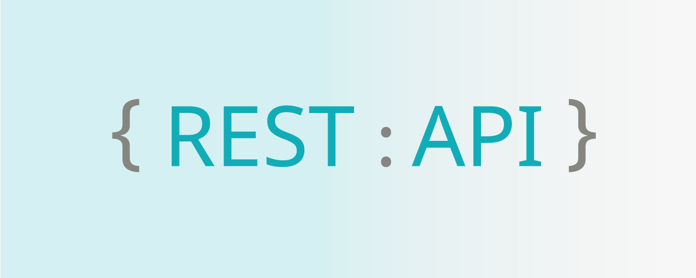

# REST API - A High Level Overview for Beginners
### Learning objectives:
1. What's an API?
2. What's a RESTful API?
3. This project will help us conceptualize how an API sends and receives data from a server (the information provider). It'll provide us an high level perspective of API routes and calls.

### Technologies and Protocols:
* Node JS + JSON packages
* Dependencies: Express, body-parser & nodeman
* Postman: test API calls & act as end-user inputs (header information). 

# What the heck is a REST API?
First, let’s go over what is an API. An API (application programming interface) is a mediator that helps you (the information user) communicate with the information provider. APIs help you access data whiling hiding the complexity.  

A RESTful API (representational state transfer) futures the functionality with a client-server architecture made up of clients, servers, and resources, with requests managed through HTTP.

In our example, you are a patient visiting a clinic. You have four options when you reach the front desk:
1. request medical information
2. change medical info
3. change phone number
4. delete info

Each option you have as the visitor corresponds with “route” or request method you can make through the API: 
Four  common HTTP request methods
* HTTP GET - request medical information
* HTTP PUT - change medical info
* HTTP POST - change phone number 
* HTTP DELETE - delete info 

# Postman

